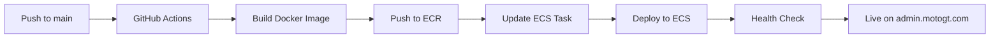

# AWS ECS Deployment Guide - Next.js Admin Dashboard

## Overview

This project is automatically deployed to **AWS ECS (Elastic Container Service)** using Docker containers. The deployment is fully automated through **GitHub Actions** and is triggered on every push to the `main` branch.

**Production URL**: https://admin.motogt.com

---

## Architecture

### Cloud Services

1. **AWS ECR (Elastic Container Registry)**
   - Repository: `motgt-admin-dashboard`
   - Purpose: Store Docker images
   - Region: `us-east-1`

2. **AWS ECS (Elastic Container Service)**
   - Cluster: `motgt-cluster`
   - Service: `motgt-admin-service`
   - Launch Type: **Fargate** (serverless containers)
   - Task Definition: `motgt-admin-dashboard`

3. **Application Load Balancer (ALB)**
   - Purpose: Route traffic to ECS tasks
   - Health checks enabled
   - SSL/TLS termination

4. **AWS CloudFront CDN** (Optional)
   - Distribution ID: `E3J5A7RK6B6E2K`
   - Purpose: Global CDN, caching, DDoS protection
   - Custom Domain: `admin.motogt.com`

5. **GitHub Actions**
   - CI/CD automation
   - Docker build and push to ECR
   - ECS service updates

---

## Deployment Workflow

### Automatic Deployment Process



### Step-by-Step Breakdown

1. **Code Checkout**
   - Latest code pulled from repository

2. **AWS Authentication**
   - Configure AWS credentials
   - Login to Amazon ECR

3. **Docker Build**
   ```bash
   docker build -t motgt-admin-dashboard .
   ```
   - Multi-stage build for optimization
   - Node.js 20 Alpine base image
   - Production-optimized Next.js build

4. **Push to ECR**
   ```bash
   docker tag motgt-admin-dashboard:latest ACCOUNT_ID.dkr.ecr.us-east-1.amazonaws.com/motgt-admin-dashboard:latest
   docker push ACCOUNT_ID.dkr.ecr.us-east-1.amazonaws.com/motgt-admin-dashboard:latest
   ```

5. **Update Task Definition**
   - New image reference added
   - Environment variables injected
   - Task definition registered

6. **Deploy to ECS**
   - ECS service updated with new task definition
   - Rolling update initiated
   - Old tasks drained gracefully
   - New tasks started and health checked

7. **Health Verification**
   - Wait for service stability
   - Verify all tasks are healthy
   - Deployment marked as successful

---

## Required Files & Configuration

### 1. GitHub Actions Workflows

#### `.github/workflows/deploy.yml`
Main deployment pipeline for Docker + ECS deployment.

**Key Configurations:**
- Trigger: Push to `main` branch
- Steps: Build Docker → Push to ECR → Deploy to ECS
- Env Variables: Injected during task definition update

#### `.github/workflows/ci.yml`
Continuous integration for code quality.

**Runs on:**
- Push to `main`
- Pull requests to `main`

**Checks:**
- Linting
- Build validation

### 2. AWS Configuration

#### `.aws/task-definition.json`
ECS task definition with container specifications.

**Configuration:**
- CPU: 256 (0.25 vCPU)
- Memory: 512 MB
- Container Port: 3000
- Health Check: HTTP GET on port 3000
- Logs: CloudWatch `/ecs/motgt-admin-dashboard`

### 3. Docker Configuration

#### `Dockerfile`
Multi-stage Docker build for Next.js.

**Stages:**
1. **base**: Node.js 20 Alpine with pnpm
2. **deps**: Install dependencies
3. **builder**: Build Next.js application
4. **runner**: Production runtime (minimal)

**Output:**
- Standalone Next.js server
- Static assets
- Optimized for production

#### `next.config.mjs`
Next.js configuration.

**Required Settings:**
```javascript
{
  output: 'standalone' // Required for Docker deployment
}
```

---

## AWS Infrastructure Setup

### Prerequisites

Before deploying, you need to set up the following AWS resources:

### 1. Create ECR Repository

```bash
aws ecr create-repository \
  --repository-name motgt-admin-dashboard \
  --region us-east-1
```

**Output:** Note the `repositoryUri` (e.g., `123456789.dkr.ecr.us-east-1.amazonaws.com/motgt-admin-dashboard`)

### 2. Create ECS Cluster

```bash
aws ecs create-cluster \
  --cluster-name motgt-cluster \
  --region us-east-1
```

### 3. Create CloudWatch Log Group

```bash
aws logs create-log-group \
  --log-group-name /ecs/motgt-admin-dashboard \
  --region us-east-1
```

### 4. Create IAM Roles

#### ECS Task Execution Role

Create a role with the following policies:
- `AmazonECSTaskExecutionRolePolicy`
- `CloudWatchLogsFullAccess`

```bash
aws iam create-role \
  --role-name ecsTaskExecutionRole \
  --assume-role-policy-document file://task-execution-role-trust-policy.json

aws iam attach-role-policy \
  --role-name ecsTaskExecutionRole \
  --policy-arn arn:aws:iam::aws:policy/service-role/AmazonECSTaskExecutionRolePolicy
```

**trust-policy.json:**
```json
{
  "Version": "2012-10-17",
  "Statement": [
    {
      "Effect": "Allow",
      "Principal": {
        "Service": "ecs-tasks.amazonaws.com"
      },
      "Action": "sts:AssumeRole"
    }
  ]
}
```

### 5. Update Task Definition

Update `.aws/task-definition.json`:
- Replace `YOUR_ACCOUNT_ID` with your AWS account ID
- Update ARNs for execution and task roles

### 6. Create Application Load Balancer (ALB)

1. Create an ALB in the AWS Console or via CLI
2. Create a target group (type: IP, port: 3000)
3. Configure health check path: `/`
4. Note the target group ARN

### 7. Create ECS Service

```bash
aws ecs create-service \
  --cluster motgt-cluster \
  --service-name motgt-admin-service \
  --task-definition motgt-admin-dashboard \
  --desired-count 1 \
  --launch-type FARGATE \
  --network-configuration "awsvpcConfiguration={subnets=[subnet-xxx,subnet-yyy],securityGroups=[sg-xxx],assignPublicIp=ENABLED}" \
  --load-balancers "targetGroupArn=arn:aws:elasticloadbalancing:...,containerName=motgt-admin-container,containerPort=3000"
```

**Important:** Replace subnet IDs, security group IDs, and target group ARN.

### 8. Configure CloudFront (Optional but Recommended)

Update your existing CloudFront distribution to point to the ALB:
- Origin: Your ALB DNS name
- Protocol: HTTPS only
- Cache behavior: Forward Host header
- Custom domain: `admin.motogt.com`

---

## Required GitHub Secrets

Configure these in `Settings > Secrets and variables > Actions`:

| Secret Name | Description | Required |
|------------|-------------|----------|
| `AWS_ACCESS_KEY_ID` | AWS IAM access key ID | ✅ Yes |
| `AWS_SECRET_ACCESS_KEY` | AWS IAM secret access key | ✅ Yes |
| `NEXT_PUBLIC_API_BASE_URL` | Backend API URL | ✅ Yes |

### AWS IAM Permissions Required

The IAM user needs these permissions:
```json
{
  "Version": "2012-10-17",
  "Statement": [
    {
      "Effect": "Allow",
      "Action": [
        "ecr:GetAuthorizationToken",
        "ecr:BatchCheckLayerAvailability",
        "ecr:GetDownloadUrlForLayer",
        "ecr:BatchGetImage",
        "ecr:PutImage",
        "ecr:InitiateLayerUpload",
        "ecr:UploadLayerPart",
        "ecr:CompleteLayerUpload"
      ],
      "Resource": "*"
    },
    {
      "Effect": "Allow",
      "Action": [
        "ecs:UpdateService",
        "ecs:DescribeServices",
        "ecs:DescribeTaskDefinition",
        "ecs:RegisterTaskDefinition"
      ],
      "Resource": "*"
    },
    {
      "Effect": "Allow",
      "Action": [
        "iam:PassRole"
      ],
      "Resource": "arn:aws:iam::*:role/ecsTaskExecutionRole"
    }
  ]
}
```

---

## Local Testing

### Test Docker Build Locally

```bash
# Build the image
docker build -t motgt-admin-dashboard .

# Run the container
docker run -p 3000:3000 \
  -e NEXT_PUBLIC_API_BASE_URL=https://api.motogt.com/api \
  motgt-admin-dashboard

# Visit http://localhost:3000
```

### Test with Docker Compose (Optional)

Create `docker-compose.yml`:
```yaml
version: '3.8'
services:
  admin:
    build: .
    ports:
      - "3000:3000"
    environment:
      - NEXT_PUBLIC_API_BASE_URL=https://api.motogt.com/api
      - NODE_ENV=production
```

Run:
```bash
docker-compose up
```

---

## Manual Deployment

If GitHub Actions is unavailable:

```bash
# 1. Get your AWS account ID
AWS_ACCOUNT_ID=$(aws sts get-caller-identity --query Account --output text)

# 2. Login to ECR
aws ecr get-login-password --region us-east-1 | \
  docker login --username AWS --password-stdin $AWS_ACCOUNT_ID.dkr.ecr.us-east-1.amazonaws.com

# 3. Build and tag
docker build -t motgt-admin-dashboard .
docker tag motgt-admin-dashboard:latest \
  $AWS_ACCOUNT_ID.dkr.ecr.us-east-1.amazonaws.com/motgt-admin-dashboard:latest

# 4. Push to ECR
docker push $AWS_ACCOUNT_ID.dkr.ecr.us-east-1.amazonaws.com/motgt-admin-dashboard:latest

# 5. Update ECS service
aws ecs update-service \
  --cluster motgt-cluster \
  --service motgt-admin-service \
  --force-new-deployment \
  --region us-east-1
```

---

## Monitoring & Logs

### View Logs

**CloudWatch Logs:**
```bash
aws logs tail /ecs/motgt-admin-dashboard --follow
```

**Or in AWS Console:**
1. Go to CloudWatch → Log Groups
2. Select `/ecs/motgt-admin-dashboard`
3. View log streams

### Monitor ECS Service

```bash
# Check service status
aws ecs describe-services \
  --cluster motgt-cluster \
  --services motgt-admin-service

# List running tasks
aws ecs list-tasks \
  --cluster motgt-cluster \
  --service-name motgt-admin-service

# Describe task
aws ecs describe-tasks \
  --cluster motgt-cluster \
  --tasks TASK_ARN
```

### Service Metrics

**AWS Console:**
- ECS → Clusters → motgt-cluster → Services → motgt-admin-service
- View: CPU, Memory, Request count, Response times

---

## Troubleshooting

### Deployment Fails

| Issue | Solution |
|-------|----------|
| ECR push fails | Verify IAM permissions for ECR |
| Task fails to start | Check CloudWatch logs for errors |
| Health check fails | Verify app starts on port 3000 |
| Service stuck in deployment | Check task definition and resource limits |

### Container Crashes

**Check logs:**
```bash
aws logs tail /ecs/motgt-admin-dashboard --follow
```

**Common issues:**
- Out of memory: Increase memory in task definition
- Environment variables missing: Update task definition
- Build errors: Test Docker build locally

### Service Not Accessible

**Verify:**
1. Security group allows inbound on port 3000
2. Target group health checks are passing
3. ALB listener rules are correct
4. CloudFront origin is pointing to ALB

---

## Scaling

### Auto Scaling

Configure ECS service auto-scaling:

```bash
# Register scalable target
aws application-autoscaling register-scalable-target \
  --service-namespace ecs \
  --scalable-dimension ecs:service:DesiredCount \
  --resource-id service/motgt-cluster/motgt-admin-service \
  --min-capacity 1 \
  --max-capacity 10

# Create scaling policy (CPU-based)
aws application-autoscaling put-scaling-policy \
  --service-namespace ecs \
  --scalable-dimension ecs:service:DesiredCount \
  --resource-id service/motgt-cluster/motgt-admin-service \
  --policy-name cpu-scaling-policy \
  --policy-type TargetTrackingScaling \
  --target-tracking-scaling-policy-configuration file://scaling-policy.json
```

**scaling-policy.json:**
```json
{
  "TargetValue": 70.0,
  "PredefinedMetricSpecification": {
    "PredefinedMetricType": "ECSServiceAverageCPUUtilization"
  },
  "ScaleInCooldown": 300,
  "ScaleOutCooldown": 60
}
```

### Manual Scaling

```bash
aws ecs update-service \
  --cluster motgt-cluster \
  --service motgt-admin-service \
  --desired-count 3
```

---

## Cost Optimization

### Current Configuration
- **Fargate vCPU**: 0.25 vCPU @ $0.04048/hour = ~$29/month
- **Fargate Memory**: 0.5 GB @ $0.004445/GB/hour = ~$3/month
- **Data Transfer**: First 100 GB free, then $0.09/GB
- **ECR Storage**: $0.10/GB/month (minimal for Docker images)

**Estimated Monthly Cost:** ~$35-50 (single task)

### Cost Saving Tips
1. Use Fargate Spot for non-production (70% discount)
2. Set up auto-scaling to scale down during low traffic
3. Use CloudFront caching to reduce ECS load
4. Clean up old ECR images regularly

---

## Security Best Practices

1. **Container Security**
   - Run as non-root user (already configured)
   - Minimal base image (Alpine)
   - Regular image updates

2. **Network Security**
   - Use VPC with private subnets
   - Security groups restrict access
   - ALB handles SSL/TLS termination

3. **Secrets Management**
   - Never commit secrets to Git
   - Use GitHub Secrets for CI/CD
   - Consider AWS Secrets Manager for sensitive data

4. **IAM Best Practices**
   - Principle of least privilege
   - Separate roles for task execution and task
   - Rotate access keys regularly

---

## Rollback Strategy

### Automatic Rollback

ECS deployment will automatically rollback if:
- New tasks fail health checks
- Service becomes unstable

### Manual Rollback

```bash
# List task definitions
aws ecs list-task-definitions --family-prefix motgt-admin-dashboard

# Update service to previous revision
aws ecs update-service \
  --cluster motgt-cluster \
  --service motgt-admin-service \
  --task-definition motgt-admin-dashboard:PREVIOUS_REVISION
```

---

## Migration from S3 + CloudFront

Since you're replacing the old static site:

1. **DNS Update**: Point `admin.motogt.com` to new ALB
2. **CloudFront**: Update origin to ALB (or remove if not needed)
3. **S3 Bucket**: Can be deleted after successful migration
4. **Test**: Verify all functionality works in new deployment

---

## Maintenance

### Regular Tasks

1. **Monitor deployments** via GitHub Actions
2. **Check ECS service health** weekly
3. **Review CloudWatch metrics** for performance
4. **Update dependencies** monthly
5. **Rotate AWS credentials** every 90 days

### Clean Up Old Images

```bash
# List images
aws ecr list-images --repository-name motgt-admin-dashboard

# Delete old images (keep last 10)
aws ecr batch-delete-image \
  --repository-name motgt-admin-dashboard \
  --image-ids imageTag=old-tag-1 imageTag=old-tag-2
```

---

## Additional Resources

- [AWS ECS Documentation](https://docs.aws.amazon.com/ecs/)
- [AWS Fargate Pricing](https://aws.amazon.com/fargate/pricing/)
- [Next.js Docker Deployment](https://nextjs.org/docs/deployment#docker-image)
- [GitHub Actions for AWS](https://github.com/aws-actions)

---

## Support

For deployment issues:
1. Check GitHub Actions logs
2. Review ECS task logs in CloudWatch
3. Verify AWS resource configuration
4. Contact DevOps team

**Last Updated:** November 22, 2025
